# Manual de Usuario - Server Manager

## Tabla de Contenidos

1. [Introducción](#introducción)
2. [Sistema de Roles](#sistema-de-roles)
3. [Inicio de Sesión](#inicio-de-sesión)
4. [Página Principal](#página-principal)
5. [Gestión de Servidores](#gestión-de-servidores)
6. [Gestión de GPUs](#gestión-de-gpus)
7. [Calendario de Reservas](#calendario-de-reservas)
8. [Gestión de Usuarios (Solo Administradores)](#gestión-de-usuarios-solo-administradores)
9. [Logs de Eventos (Solo Administradores)](#logs-de-eventos-solo-administradores)
10. [Estadísticas](#estadísticas)
11. [Perfil de Usuario](#perfil-de-usuario)

---

## Introducción

Server Manager es una aplicación web diseñada para la gestión integral de servidores y GPUs en entornos de investigación y desarrollo. Permite administrar recursos computacionales, gestionar usuarios con diferentes niveles de acceso, y controlar el uso de GPUs mediante un sistema de reservas eficiente.

La interfaz es responsive y está disponible en español e inglés, facilitando su uso en equipos internacionales.

---

## Sistema de Roles

La aplicación cuenta con tres tipos de usuarios con diferentes niveles de acceso:

### Administrador (ADMIN)
- Acceso completo a todas las funcionalidades
- Puede crear, editar y eliminar servidores
- Puede crear y gestionar usuarios
- Puede asignar categorías y mentores
- Tiene acceso a los logs de eventos
- Tiene acceso a las estadísticas de uso
- Puede reservar GPUs

### Investigador (RESEARCHER)
- Puede ver y acceder a servidores asignados
- Puede reservar GPUs
- Puede ver el calendario de reservas
- Puede extender sus propias reservas
- Tiene acceso a las estadísticas de uso de los servidores a los que tiene acceso
- No puede gestionar usuarios ni servidores

### Junior Researcher (JUNIOR_RESEARCHER)
- Puede ver y acceder a servidores asignados
- Puede reservar GPUs (requiere mentor asignado)
- Puede ver el calendario de reservas
- Puede extender sus propias reservas
- Necesita un mentor asignado para realizar ciertas acciones
- No puede ver estadísticas de uso
- No puede gestionar usuarios ni servidores

---

## Inicio de Sesión

### Acceso a la Aplicación

1. Abre tu navegador web y navega a la URL de la aplicación (por defecto: `http://localhost:3000`)
2. Serás redirigido automáticamente a la página de inicio de sesión

La página de login muestra:
- Campo de email
- Campo de contraseña
- Botón de inicio de sesión
- Selector de idioma (español/inglés)
- Opción de recuperación de contraseña

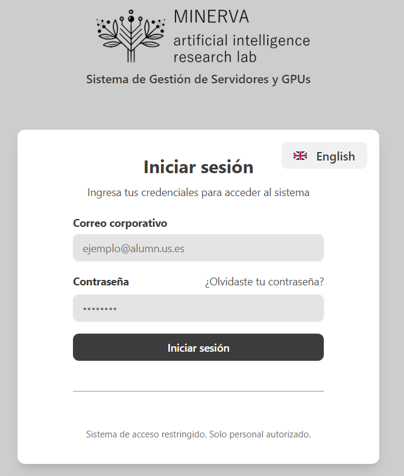

### Credenciales de Prueba

Si estás utilizando el entorno de desarrollo, las siguientes credenciales están disponibles después de ejecutar el seed:

- **Administrador**: `admin@example.com` / `admin123`
- **Investigador**: `researcher@example.com` / `admin123`
- **Junior Researcher**: `junior@example.com` / `admin123`

### Recuperación de Contraseña

Si olvidaste tu contraseña:
1. Haz clic en el enlace "¿Olvidaste tu contraseña?" debajo del campo de contraseña
2. Ingresa tu correo electrónico
3. Recibirá un email con instrucciones para restablecer tu contraseña en la cuenta indicada en la aplicación

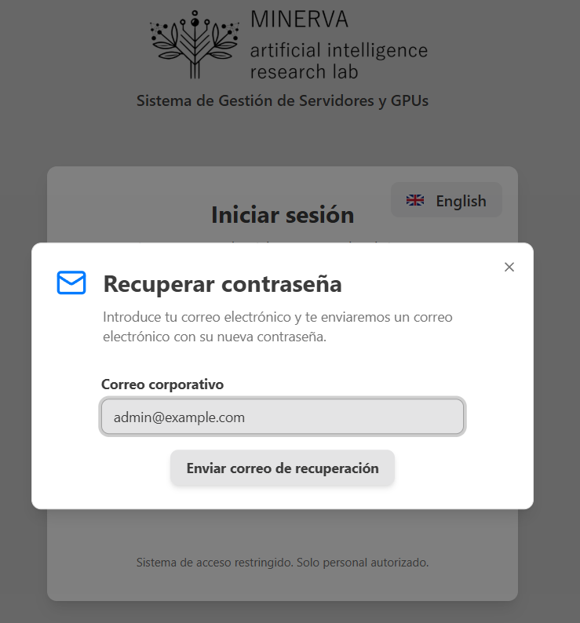

### Cambio de Idioma

La aplicación soporta español e inglés. Para cambiar el idioma:
1. En la página de login, haz clic en el selector de idioma en la esquina superior derecha
2. Selecciona tu idioma preferido

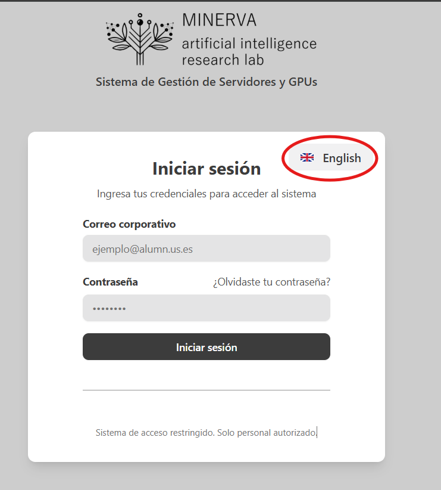

Una vez iniciada la sesión, también puedes cambiar el idioma desde la barra lateral.

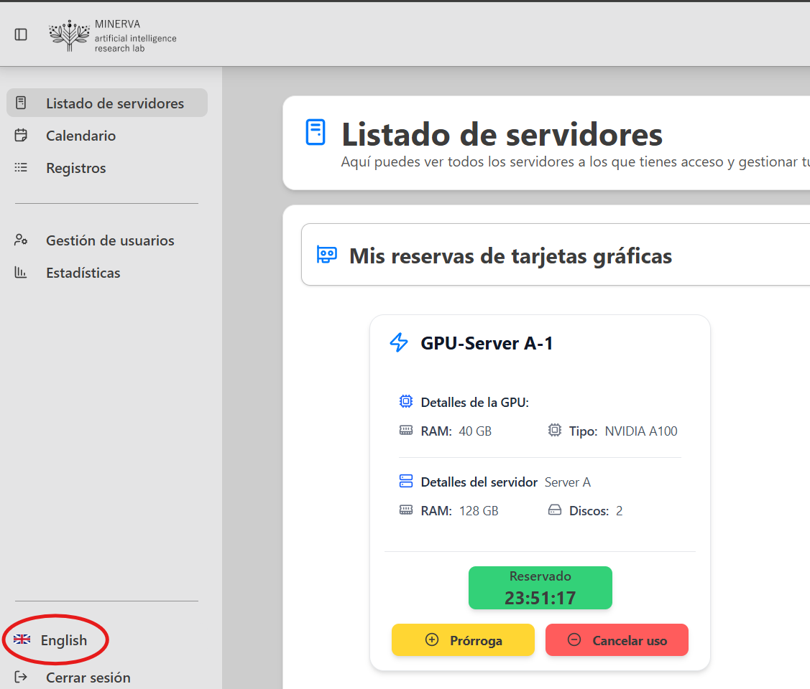

---

## Página Principal

Al iniciar sesión, serás redirigido a la página principal (Home), que muestra:

- Lista de servidores accesibles
- Lista de reservas de GPUs activas
- Barra de búsqueda para servidores y GPUs
- Botón para crear nuevos servidores (solo administradores)

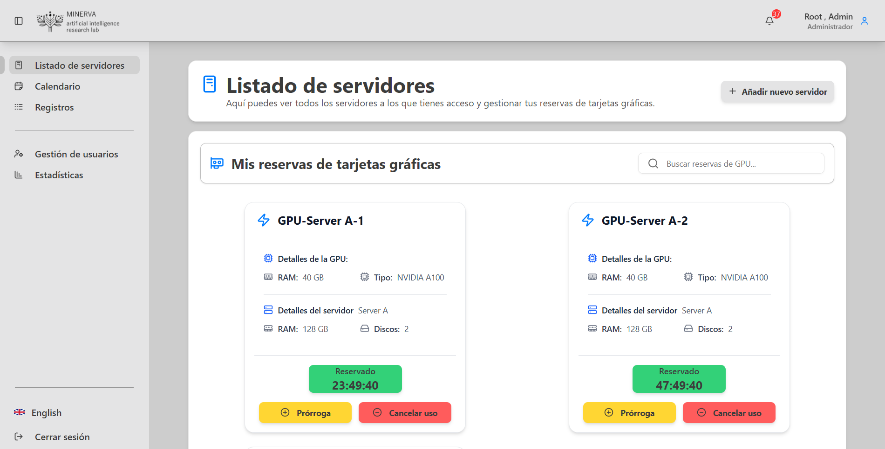

### Navegación

La barra lateral izquierda proporciona acceso a todas las secciones de la aplicación:
- **Home**: Página principal
- **Calendar**: Calendario de reservas de GPUs
- **Servers**: Lista de servidores (solo administradores)
- **Users**: Gestión de usuarios (solo administradores)
- **Logs**: Registro de eventos (solo administradores)

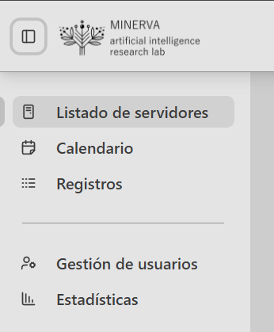

### Barra de Búsqueda

En la página principal, puedes buscar:
- **GPUs**: Filtra las reservas de GPUs por nombre o servidor
- **Servidores**: Filtra la lista de servidores por nombre

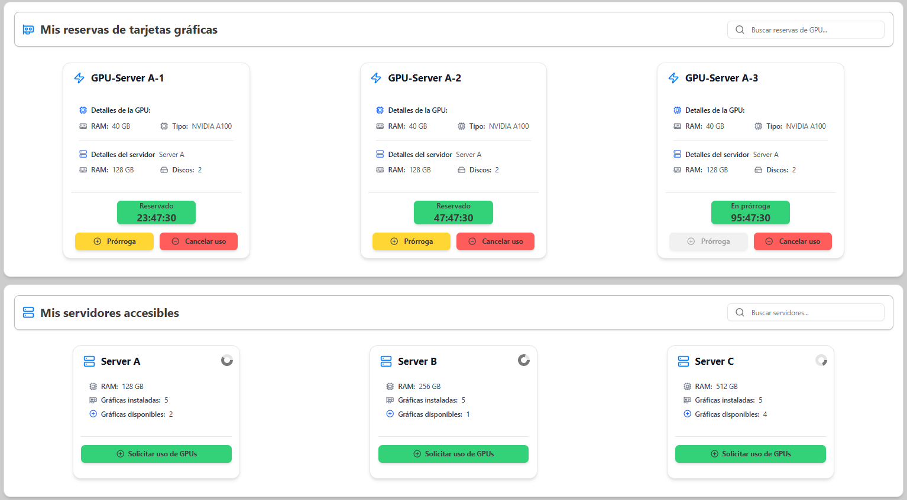

### Lista de Reservas de GPUs

Esta sección muestra todas las reservas de GPUs activas con:
- Nombre de la GPU
- Servidor donde está ubicada
- Usuario que tiene la reserva
- Fecha y hora de inicio y fin
- Botón para extender la reserva (si eres el propietario)
- Estado de la reserva

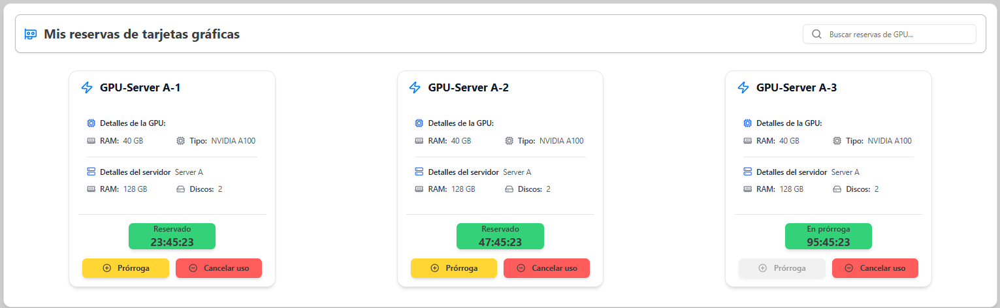

### Lista de Servidores Accesibles

Esta sección muestra los servidores a los que tienes acceso con:
- Nombre del servidor
- Estado (disponible/no disponible)
- Información de GPUs
- Botón para ver detalles

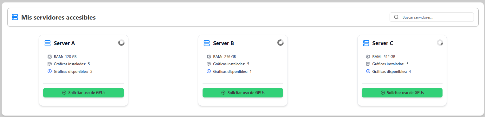

### Crear Nuevo Servidor (Solo Administradores)

Si eres administrador, verás un botón "Crear Servidor" en la sección de servidores:

1. Haz clic en el botón "Crear Servidor"
2. Completa el formulario con:
   - Nombre del servidor
   - RAM (GB)
   - Cantidad de Discos
   - Tarjetas gráficas (puedes añadir múltiples GPUs con los campos: Nombre de la GPU, RAM (GB) y Tipo de GPU)
3. Haz clic en "Crear servidor"

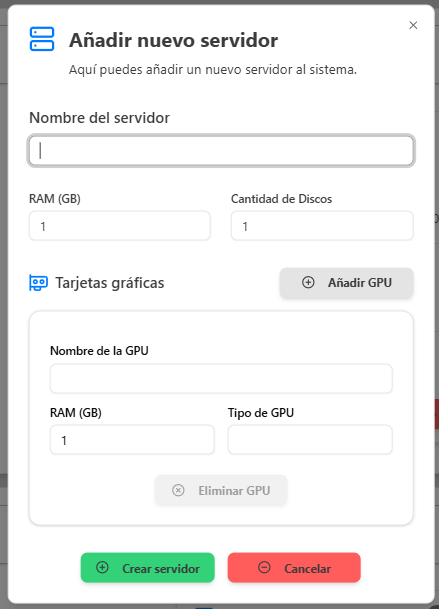

---

## Gestión de Servidores

### Ver Detalles de un Servidor

Para ver los detalles de un servidor específico:

1. En la página principal en la parte de listado de servidores accesibles, haz clic en el servidor que deseas ver
2. Se abrirá la página de detalles del servidor

La página de detalles muestra:
- **Información General**: Nombre del servidor, RAM (GB), Cantidad de Discos, Estado (disponible/no disponible)
- **Tarjetas Gráficas**: Lista de GPUs con su nombre, RAM y tipo
- **Gráfico de Uso**: Donut chart mostrando el porcentaje de GPUs en uso vs disponibles
- **Reservas Activas**: Lista de reservas actuales en este servidor con información de usuario y fechas

Si eres administrador, puedes editar cualquier información del servidor, incluyendo cambiar su estado entre "Disponible" y "No Disponible":

1. En la página de detalles, haz clic en el botón "Editar"
2. Modifica los campos necesarios (nombre, RAM, cantidad de discos, tarjetas gráficas, estado, etc.)
3. Haz clic en "Guardar"

---

## Gestión de GPUs

### Crear una Reserva de GPU

Para reservar una GPU:

1. En la página principal, busca la sección "Mis servidores accesibles"
2. Haz clic en el botón "Solicitar uso de GPU" para solicitar el uso de la GPU de un servidor
   
3. Se abrirá el formulario de reserva
   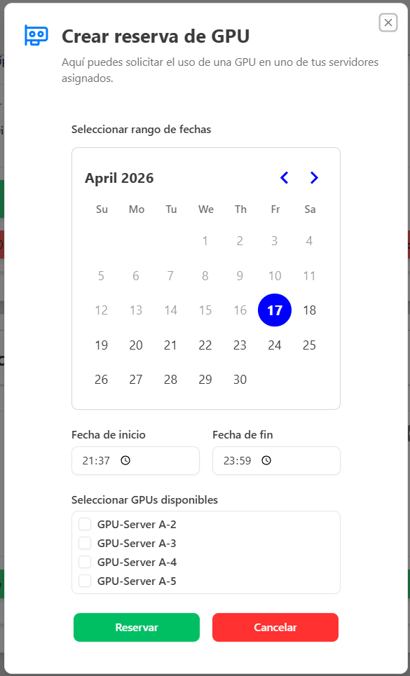

### Formulario de Reserva

El formulario de reserva requiere:
- **Seleccionar GPU**: Selecciona la GPU que deseas reservar de la lista de disponibles
- **Fecha de inicio**: Selecciona la fecha de inicio de la reserva
- **Fecha de fin**: Selecciona la fecha de fin de la reserva
- **Hora de inicio**: Selecciona la hora de inicio de la reserva
- **Hora de fin**: Selecciona la hora de fin de la reserva

### Confirmar Reserva

1. Revisa los detalles de la reserva
2. Haz clic en "Confirmar Reserva"
3. La reserva se creará y aparecerá en la lista de reservas activas

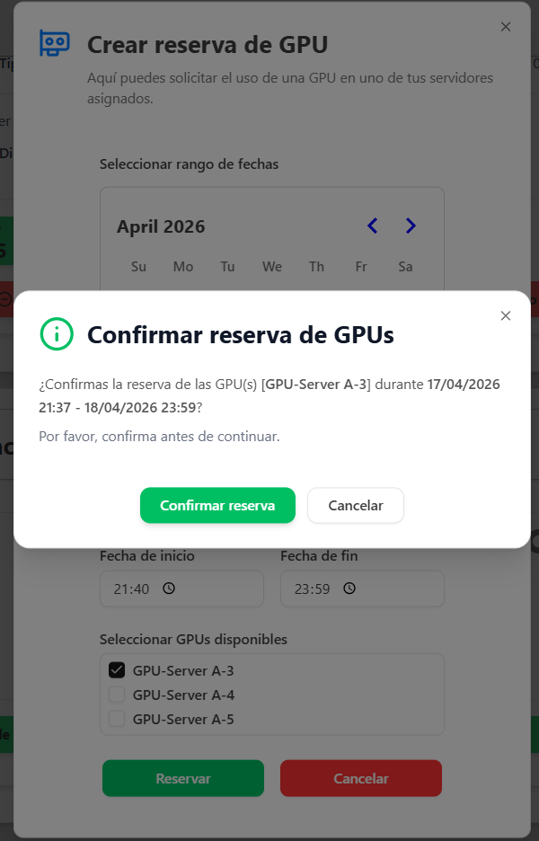

### Extender una Reserva

Si necesitas más tiempo con una GPU:

1. En la lista de reservas, busca tu reserva
2. Haz clic en el botón "Prórroga"
3. Selecciona la cantidad de horas que quieres extenderlo (entre 1 y 12 horas)
4. Haz clic en "Confirmar"

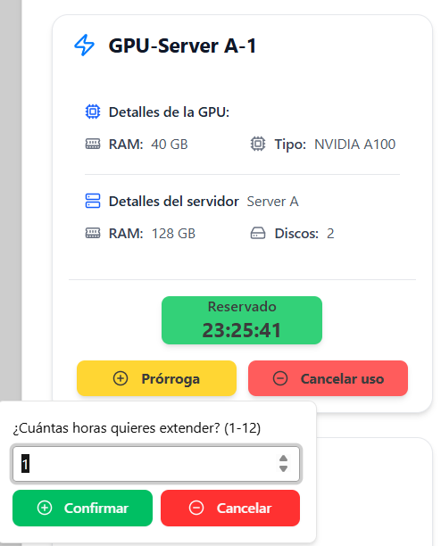

### Cancelar una Reserva

Para cancelar una reserva:

1. En la lista de reservas, busca tu reserva
2. Haz clic en el botón "Cancelar"
3. Confirma la cancelación en el diálogo

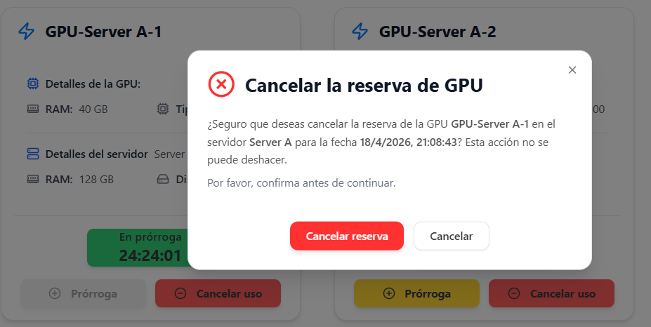

---

## Calendario de Reservas

Para ver el calendario de reservas de GPUs:

1. Haz clic en "Calendar" en la barra lateral
2. Se mostrará el calendario con todas las reservas organizadas por días
3. Puedes navegar entre meses usando las flechas
4. Haz clic en una reserva para ver sus detalles

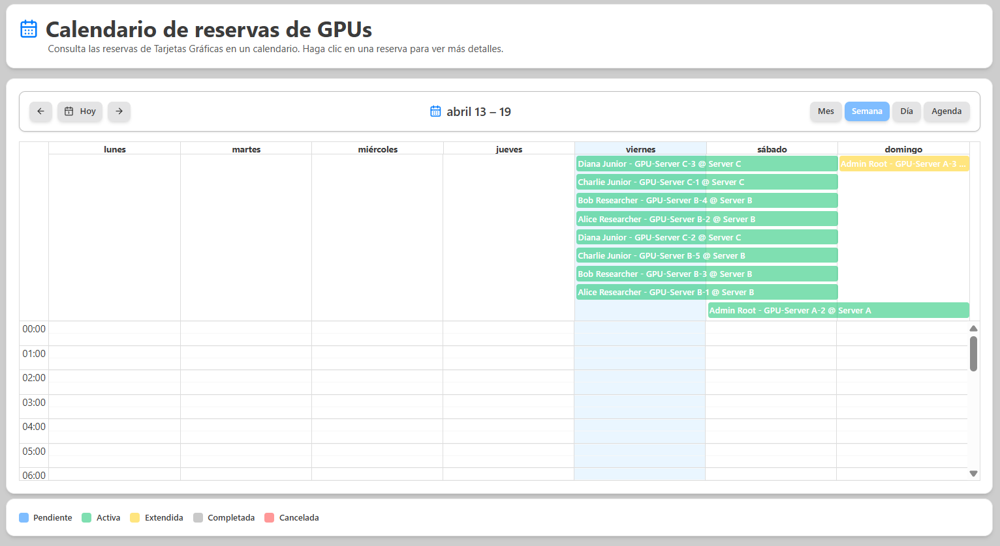

---

## Gestión de Usuarios (Solo Administradores)

### Acceder a la Gestión de Usuarios

Para gestionar usuarios:

1. Haz clic en "Users" en la barra lateral (solo visible para administradores)
2. Se mostrará la lista de todos los usuarios

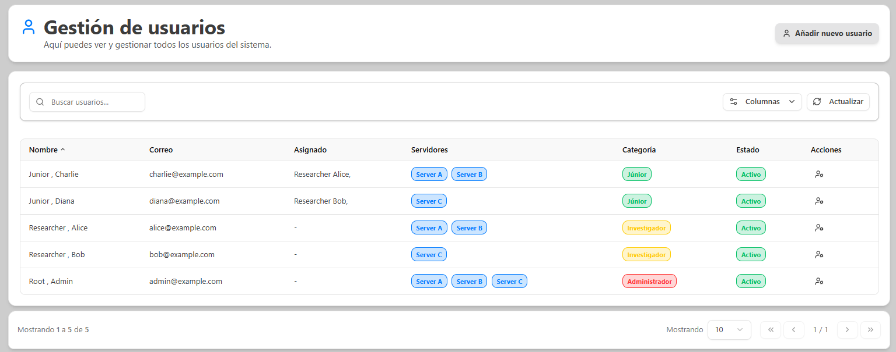

La tabla de usuarios muestra:
- Email
- Nombre completo
- Categoría (ADMIN, RESEARCHER, JUNIOR)
- Mentor (para junior researchers)
- Servidores asignados
- Acciones disponibles

Desde la columna de acciones, puedes realizar operaciones como editar la categoría del usuario, asignar o desasignar servidores, asignar un mentor a junior researchers, o eliminar usuarios del sistema.

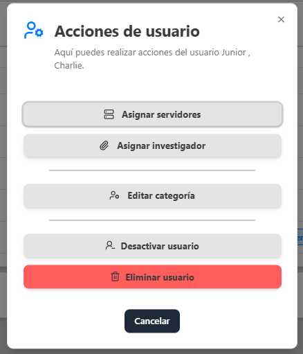

Para crear un nuevo usuario:

1. Haz clic en el botón "Crear Usuario"
2. Completa el formulario con:
   - Email
   - Nombre
   - Primer apellido
   - Segundo apellido
   - Categoría (ADMIN, RESEARCHER, JUNIOR)
3. Si la categoría es JUNIOR, selecciona un mentor
4. Haz clic en "Crear"

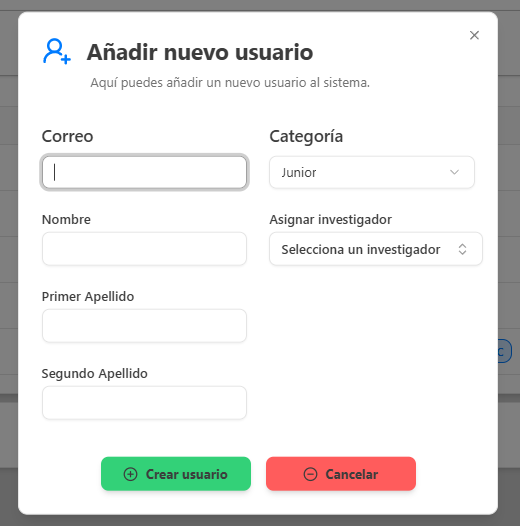

---

## Logs de Eventos (Solo Administradores)

Para ver el registro de eventos:

1. Haz clic en "Logs" en la barra lateral (solo visible para administradores)
2. Se mostrará el historial completo de eventos con información de fecha, usuario, acción y recurso
3. Puedes filtrar por fecha, usuario, tipo de acción o recurso
4. Exporta los logs en CSV o JSON si es necesario

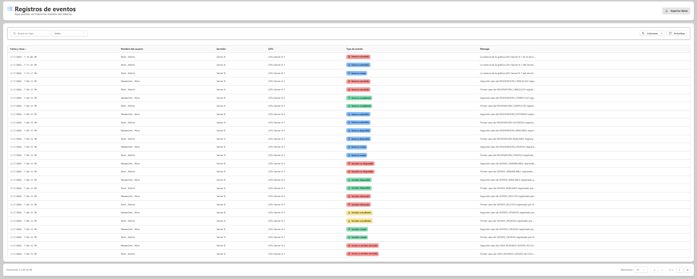

---

## Estadísticas (Administradores e Investigadores)

La sección de estadísticas permite analizar el uso de servidores y GPUs a lo largo del tiempo.

Para acceder a estadísticas:

1. Haz clic en "Statistics" en la barra lateral
2. Selecciona el rango de fechas que deseas analizar
3. Revisa los gráficos y métricas disponibles

En esta vista podrás consultar, según tu rol y permisos:

- Uso de GPUs por servidor
- Tasa de ocupación de recursos
- Evolución temporal de reservas
- Comparativa de recursos en uso frente a recursos disponibles

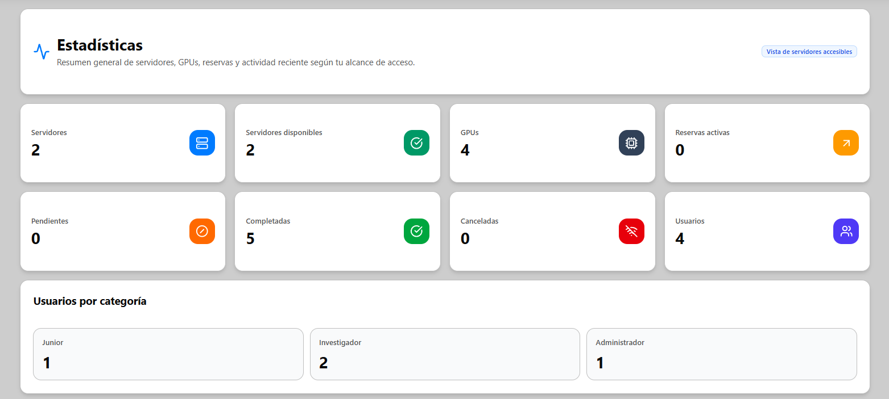

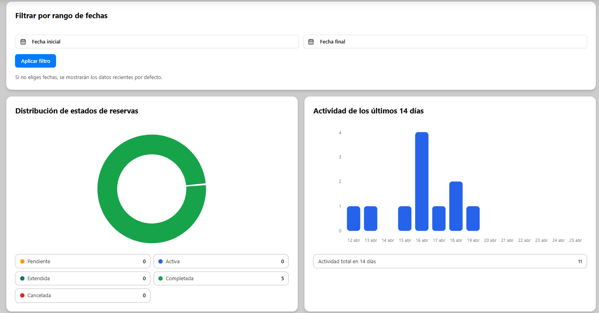

---

## Perfil de Usuario

Para acceder a tu perfil y gestionar tu cuenta:

1. Haz clic en tu nombre o avatar en la barra superior
2. Selecciona "Perfil"
3. Verás tu información personal (email, nombre, categoría, mentor si aplica)
4. Desde el diálogo puedes cambiar tu contraseña haciendo clic en la sección correspondiente

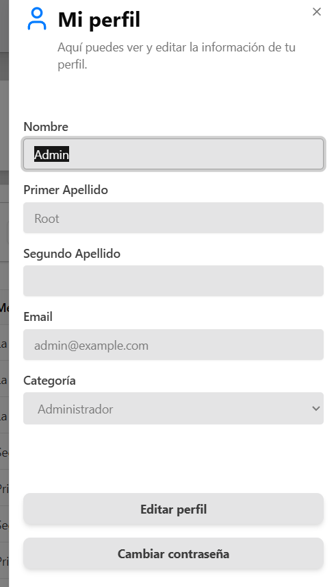

---

## Cerrar Sesión

Para cerrar sesión:

1. En la barra lateral, haz clic en el botón "Cerrar Sesión" en la parte inferior
2. Serás redirigido a la página de login
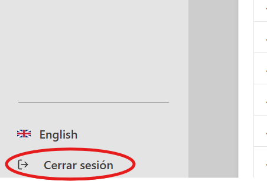
